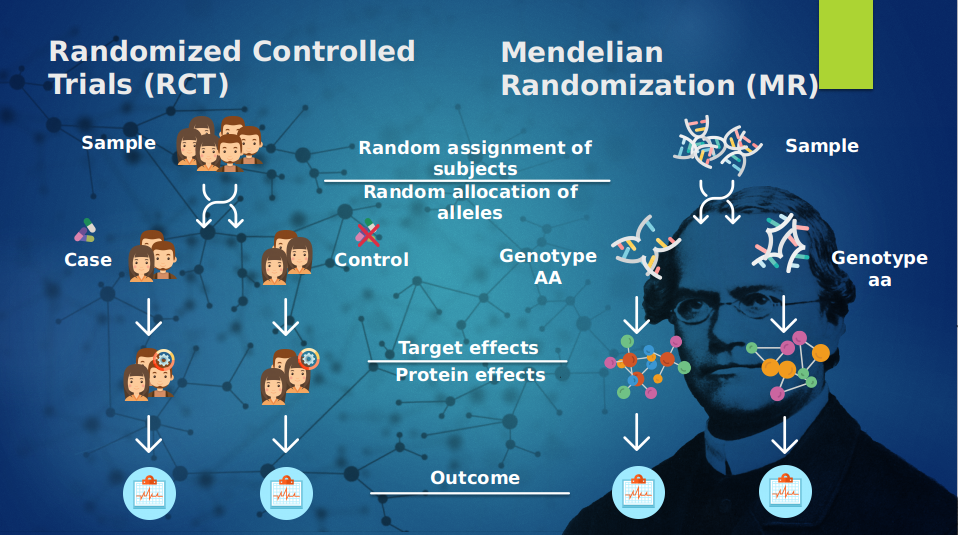
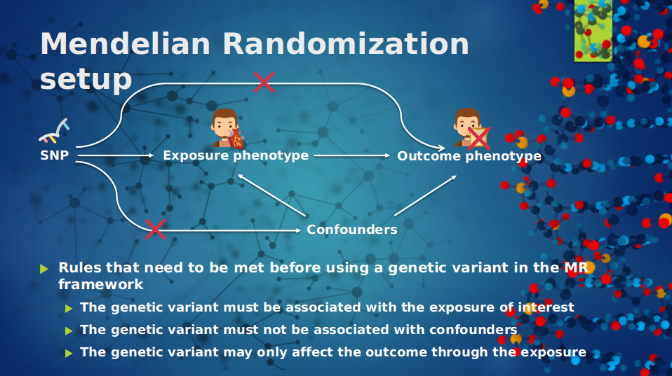
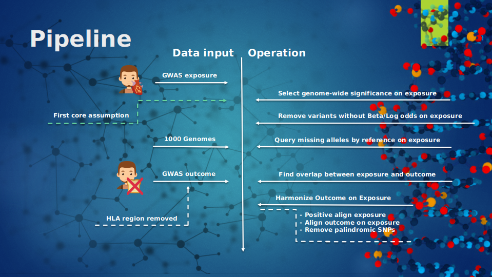
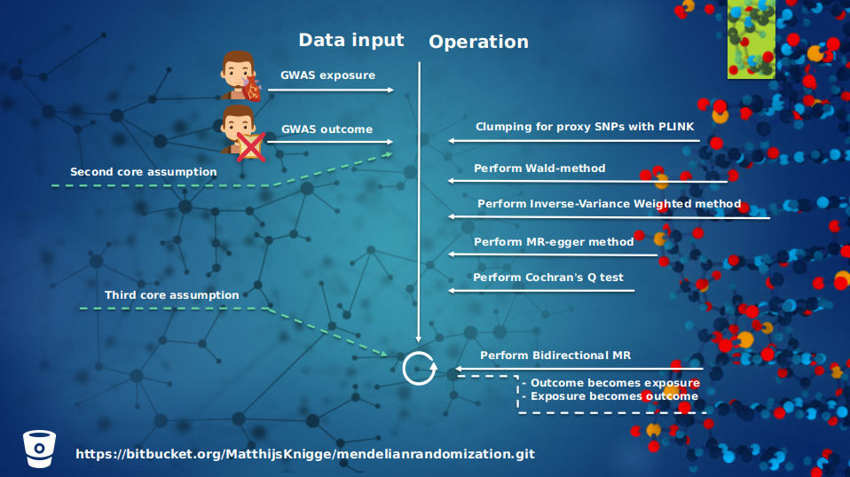

# Mendelian Randomization

---

Mendelian Randomization (MR) is the process that refers to the random segregation and assortment of genes from ancestors to offspring that takes place during gamete formation and gives a method of using genetic variants to make casual inferences regarding the relationship between exposure and outcomes. The basic principle utilized in the MR pipeline, is that if a genetic variant either alters the level of or mimics the biological effects of a exposure that itself alters disease risk, then these genetic variants should be related to disease risk.The goal of MR studies is to provide evidence for or against a causal relationship between a exposure and a disease. Genetic variants are used because these are less susceptible for confounding because of it is subjected to Mendel’s first law, the law of of segregation. These genetic variants segregate independently and randomly from environmental factors, and it can be assumed that genetic variants segregate independently from other traits.^{[1]}


The MR approach is quite similar to Randomized Controlled Trials, in where there is a population sample which is divided randomly into two arms to evenly distribute potential confounders, upon both of these arms are some forms of experiments conducted, where one group is the case and the other is the control. In the next step the effects take place which are on-, off-target effects which in turn will be compared to the control group and by which researchers are capable of doing a study upon. Due to this on-, off-target effects the direction of relationship is difficult to measure. The random segregation of  genes in the Mendelian dogma is a natural way of dividing the population into two arms where instead the case group has any given genotype, and the control has any given genotype that differs. These different genotypes result in different products, which in turn can be measured and compared. And this product is free from the effects of confounding and reverse causality because the germline precedes the disease of interest. And the genetic variants segregate randomly and independently. Mendelian Randomization gives us the power to use genetic variants in observational settings to make causal inferences regarding the relationship between an exposure and an outcome, and for this the summary statistics from Genome-Wide-Association-Studies (GWAS) can be used. See figure 1.

The Mendelian Framework is quite straight forward, in order test if there is a causal relationship between an exposure for example cholesterol, and outcome for example celiac disease we need from both variables a GWASs, and before interpreting the results from a Mendelian Randomization analysis, the genetic variants must be tested on three criteria: 

  *	the genetic variant must be associated with the exposure of interest
  * the genetic variant must not be associated with confounders
  * the genetic variant can only be associated with the outcome through the exposure.

The first assumption can be verified by examining the strength of the association of the genetic variant with the exposure. This can be met by for selecting genome-wide significance on genetic variants. For the second assumption examine the possible relationship between a genetic variant and a measured confounder. For example pleiotropy, which is tested for by the MR-egger method. This method will be explained in the next slide.And for the third assumption, this is very problematic because it is very difficult to prove that the genetic variant is associated with the outcome through the exposure instead of through some other biological pathway. See figure 2.

Figure 1: An overview of the Mendelian Randomization approach                           | Figure 2: An overview of the Mendelian Randomization framework
:-------------------------------:|:------------------------------------:
 | 

This package provides functionality for the following operations:

  * Calculate the standard deviation from the effectsize or log odd score when it is not present. `mr.calculate.se()`
  
  * Clumping, for pruning SNPs that are in linkage disequilibrium (LD). ALso is provided a method for finding proxy SNPs for replacing SNPs that are in LD. `mr.clump()`
  
  * Cochran's Q test, for determining SNPs that overfit the model, or the ones that introduce pleiotropic effects. `mr.cochran.Q.test()`
  
  * Mendelian Randomization Egger method (MR-egger method) for estimating causality, testing causality, and for testing the overall pleiotropy within the data set. `mr.egger.method()`
  
  * When your data set misses allelic information, this can be queried by using a reference file. `mr.find.missing.allelic.information()`
  
  * Forest plotting the MR analysis, for seeing the overall weight a SNP brings into the study. `mr.forest.plot()`
  
  * Funnel plotting the methods used with the MR analysis to detect study bias. `mr.funnel.plot()`
  
  * Get the chromosome number and position of SNPs. `mr.get.chr.pos()`
  
  * Harmonization of the data set. Align SNPs, remove problematic SNPs, for example palindromic SNPs, mismatch SNPs, and SNPs that have a wrong reference. `mr.harmonize()`
  
  * Inverse-Variance Weighted method for averaging the estimate ratios. `mr.inverse.variance.weighted.method()`
  
  * A highly fasionable way of plotting MR results. `mr.plot()`
  
  * The functionality to pre-process data, which test the data set on missing alleles, missing beta's, selects for genome-wide significance, removes duplicates,  and removes alleles from which it is not possible to measure direction. `mr.pre.process()`
  
  * qq-plot for the p-value distribution of a chosen method. `mr.qq.p.distribution()`
  
  * A normal qq-plot for plotting the theoretical quantiles against the normal quantiles. `mr.qq.plot()`
  
  * Remove a certain region within a chromosome. `mr.remove.region()`
  
  * Perform wald-ratio for obtaining a causal estimate based on the exposure regression on genotype and the outcome regression of genotype. `mr.wald.ratio()`
  
  * Test data for trying the package.

# Installing Mendelian Randomization

---

The package is hosted on bitbucket, and this allows for a smooth installation, and updates are easy to install. Before installing Mendelian Randomization, make sure you have installed `devtools`:

```
install.packages("devtools")
```

And then you are ready to install the `mendelianRandomization` package:

```
devtools::install_bitbucket("matthijsknigge/mendelianRandomization")
```

Other libraries that are needed in this package:

```
install.packages("stringr")
install.packages("readr")
install.packages("ggplot2")
install.packages("ggExtra")
install.packages("gridExtra")
install.packages("latex2exp")
```
This package needs R version 3.2.0 or greater.

# Tutorial

---

The package also contains test data for doing a basic Mendelian Randomization analysis. The first step is to read the data. For this analysis we want to infer causality between an exposure and outcome. In this setup the exposure is Inflammatory bowel disease, and the outcome is Celiac Disease.

```
# the outcome
data("celiac")
outcome <- celiac

# the exposure
data("Inflammatory.bowel.disease")
exposure  <- Inflammatory.bowel.disease
```


Lets check out the data.
```
head(outcome)
```
Here we se a column with SNP identifiers, the effect allele, the effectsize, the pvalue, and the standard deviation.

|SNP        |effect_allele |Z_OR       |P         |se        |
|-----------|--------------|-----------|----------|----------|
|rs61733845 |T             |  0.0353671| 0.4249000| 0.0443226|
|rs1320571  |A             |  0.0188218| 0.6590000| 0.0426513|
|rs9729550  |A             |  0.1004835| 0.0000025| 0.0213295|
|rs1815606  |G             |  0.0677437| 0.0007151| 0.0200204|
|rs7515488  |T             | -0.1028082| 0.0001195| 0.0267232|
|rs11260562 |A             | -0.0393647| 0.3344000| 0.0407802|


```
head(exposure)
```
Here there is a column with the SNP identifiers, effect_allele, the effectsize, the standard deviation of the genetic effect, and the p value.

|SNP        |effect_allele |      beta|        se|  pval|
|------|-----------|--------------|----------|----------|------|
|13665 |rs1003342  |NA            |        NA|        NA| 0e+00|
|13666 |rs10051722 |A             | 0.0616269| 0.0107204| 0e+00|
|13667 |rs10061469 |A             | 0.0518248| 0.0105946| 1e-06|
|13668 |rs10065637 |G             | 0.0686809| 0.0128937| 1e-07|
|13669 |rs10142466 |NA            |        NA|        NA| 0e+00|
|13671 |rs10486483 |A             | 0.0602257| 0.0102041| 2e-07|

We need both files at least to contain the SNP id, beta, se, pval, effect allele. And the exposure must containt both alleles to infer in what the direction the effect takes place. Since the other allele is missing for the exposure, we have to query it. The alleles are queried with `mr.find.missing.alleles`.

```
exposure <- mr.find.missing.allelic.information(data = exposure, 
                                              thousand.G = "/path/to/reference.bim")
head(exposure)
```
|      |SNP        |effect_allele |      beta|        se|  pval|other_allele |
|------|-----------|--------------|----------|----------|------|-------------|
|13665 |rs1003342  |NA            |        NA|        NA| 0e+00|             |
|13666 |rs10051722 |A             | 0.0616269| 0.0107204| 0e+00|C            |
|13667 |rs10061469 |A             | 0.0518248| 0.0105946| 1e-06|             |
|13668 |rs10065637 |G             | 0.0686809| 0.0128937| 1e-07|             |
|13669 |rs10142466 |NA            |        NA|        NA| 0e+00|             |
|13671 |rs10486483 |A             | 0.0602257| 0.0102041| 2e-07|G            |

Now that we have what we need, we can start pre-processing the data. But first let's check out how many SNPs we have for exposure and outcome.

```
# exposure amount of SNPs
length(exposure$SNP)
> 196

# outcome amount of SNPs
length(outcome$rsid)
> 97434
```
The next step is to pre-process the exposure, and only the exposure because we are interested in the effect of the exposure on the outcome. We select for genome-wide significance, thus the p-value of the exposure must > 5*10^-8. Also the SNPs without effectsize will be removed, the SNPs from which it is impossible to measure the strand will be removed, and the duplicates will be removed. Besides this, also all negative effectsizes are flipped, and their alleles are also flipped. This is done because we want to measure the positive effect of the exposure on the outcome. And genetic variants without effect size are removed. This is done with `mr.pre.process`.

```
exposure <- mr.pre.process(B = exposure$beta, 
                           B.se = exposure$se, 
                           pval = exposure$pval, 
                           effect_allele = exposure$effect_allele, 
                           other_allele = exposure$other_allele, 
                           SNP = exposure$SNP)

# amount of SNP left
length(exposure$SNP)
> 52

head(exposure)

```
The product of this is a data frame containing only genome-wide significant SNPs, all signs of effect sizes that are negative are flipped because we are interested in the positive effect of the exposure on the outcome, and ambiguous alleles have been removed from the data set.

|SNP        |      beta|        se|effect_allele |other_allele |pval  |
|---|-----------|----------|----------|--------------|-------------|------|
|2  |rs10051722 | 0.0616269| 0.0107204|A             |C            |9e-09 |
|8  |rs10761659 | 0.1538111| 0.0100349|G             |A            |5e-53 |
|26 |rs11641184 | 0.0772895| 0.0102041|A             |C            |1e-14 |
|38 |rs12627970 | 0.1093163| 0.0127551|G             |A            |2e-18 |
|39 |rs12718244 | 0.0761709| 0.0102041|A             |G            |3e-14 |
|40 |rs12720356 | 0.1483323| 0.0204082|C             |A            |4e-16 |

We do not want our data set to suffer from pleiotropic effects which can be reintroduced by linkage disequilibrium. So we will clump our data set, and the SNPs that are in LD with each other will be removed and will be replaced by a suitable proxy. The clump methods has various other parameters that can be used, but here we use the default, this is done with `mr.clump`. Within the table itself nothing changes, it is the same as the previous table shown. This function parameter `verbose` is set to `TRUE` because we want to use suitable proxy SNPs instead of just removing the SNPs. Hence that also an vector of the SNPs of the outcome is given as parameter, this is because a proxy SNP must be present in both files.

```
exposure <- mr.clump(data = exposure, 
                     refdat = "/path/to/reference", 
                     verbose = T, 
                     SNPs.of.opposite.file = outcome$SNP)
length(exposure$SNP)
> 44
```

The next step is to combine both data sets, with the `mr.harmonize` function. This functions aligns the outcome on the exposure, and takes the intercept between the exposure and outcome.

```
h <- mr.harmonize(By = outcome$Z_OR, Bx = exposure$beta, 
                  By.se = outcome$se, Bx.se = exposure$se, 
                  outcome.pval = outcome$P, exposure.pval = exposure$pval, 
                  outcome.effect_allele = outcome$effect_allele, 
                  exposure.effect_allele = exposure$effect_allele, 
                  exposure.other_allele = exposure$other_allele, 
                  outcome.SNP = outcome$SNP, 
                  exposure.SNP = exposure$SNP)
head(h)
```
|SNP        |         By|        Bx|     By.se|     Bx.se|pval  |effect_allele |other_allele |
|-----------|-----------|----------|----------|----------|------|--------------|-------------|
|rs10051722 |  0.0330399| 0.0616269| 0.0201223| 0.0107204|9e-09 |A             |C            |
|rs10761659 | -0.0207825| 0.1538111| 0.0187661| 0.0100349|5e-53 |G             |A            |
|rs11641184 | -0.0201007| 0.0772895| 0.0185328| 0.0102041|1e-14 |A             |C            |
|rs12627970 | -0.0574173| 0.1093163| 0.0231297| 0.0127551|2e-18 |G             |A            |
|rs12718244 |  0.0440169| 0.0761709| 0.0187678| 0.0102041|3e-14 |A             |G            |
|rs12720356 | -0.0714960| 0.1483323| 0.0332255| 0.0204082|4e-16 |C             |A            |

Now it is time to estimate the causalty bewteen regression of the outcome on the genotype and the regression from the exposure on the genotype. Here we use the `mr.wald.method` to calculate the causal estimate between genetic variants. This method return the causal estimate, the standard error of the causal estimate, and the p-value.

```
wald    <- mr.wald.ratio(By = h$By, Bx = h$Bx, By.se = h$By.se, Bx.se = h$Bx.se)
h$iv    <- wald$iv
h$iv.se <- wald$iv.se
h$iv.p  <- wald$iv.p

head(h)
```
|SNP        |         By|        Bx|     By.se|     Bx.se|pval  |effect_allele |other_allele |         iv|     iv.se|      iv.p|
|-----------|-----------|----------|----------|----------|------|--------------|-------------|-----------|----------|----------|
|rs10051722 |  0.0330399| 0.0616269| 0.0201223| 0.0107204|9e-09 |A             |C            |  0.5361268| 0.3395761| 0.0571896|
|rs10761659 | -0.0207825| 0.1538111| 0.0187661| 0.0100349|5e-53 |G             |A            | -0.1351173| 0.1223258| 0.8653269|
|rs11641184 | -0.0201007| 0.0772895| 0.0185328| 0.0102041|1e-14 |A             |C            | -0.2600699| 0.2422305| 0.8585093|
|rs12627970 | -0.0574173| 0.1093163| 0.0231297| 0.0127551|2e-18 |G             |A            | -0.5252399| 0.2202822| 0.9914464|
|rs12718244 |  0.0440169| 0.0761709| 0.0187678| 0.0102041|3e-14 |A             |G            |  0.5778700| 0.2582662| 0.0126269|
|rs12720356 | -0.0714960| 0.1483323| 0.0332255| 0.0204082|4e-16 |C             |A            | -0.4819988| 0.2336043| 0.9804586|


Now with multiple genetic variants, their ratio estimates from the Two-sample MR can be averaged by using an Inverse Variance Weighted method to provide an overall causal estimate. This method assumes that the ratio estimates are all uncorrelated, that there is no pleiotropy. This method can be deployed with `mr.inverse.variance.weighted.method`, and will return the ivw estimate, the standard error of the estimate, and a test of the method. And also the MR-egger can be performed with a modification to the weighted linear regression from the Inverse-Variance Weighted method. Instead of setting the intercept parameter to zero, the term is estimated as part of the analysis. To see if the estimate is significant one could the test the slope and see if it is significant different than zero, this is the test for causal effect. And the intercept from the regression can be interpreted as an average pleiotropic effect. If the average pleiotropic effect is zero, then the IVW gives an constant estimate of the causal effect. But, if this is not zero, than the average pleiotropic effects differ from zero and there is pleiotropy, and than the IVW estimate is biased. This method is performed with `mr.egger.method`, and return a causal estimate, the standard error of the estimate, a test for pleiotropy, and a test for the causal estimate.

```{r}
# inverse-variance weighted method
inverse.variance.weighted <- mr.inverse.variance.weighted.method(By = h$By, Bx = h$Bx, By.se = h$By.se, Bx.se = h$Bx.se)
inverse.variance.weighted
> $ivw
0.212114
> $ivw.se
0.03140135
> $ivw.p
1.429008e-11


# mr-egger method
egger <- mr.egger.method(By = h$By, Bx = h$Bx, By.se = h$By.se, Bx.se = h$Bx.se)
egger
> $egger
0.08702163
> $egger.se
0.09879263
> $egger.p
0.3834112
> $egger.i
0.01288551
> $egger.i.se
0.03004332
> $egger.i.p
0.6701895
```

After this, the Cochran's Q test can be applied. Which is a method that is used to find SNPs which have an effect that is to great and can bias the estimates, and or removes possible pleiotropic causing SNPs. This is an iterative method that calculates the Q term for each SNP, calculates an overal Q term. Than this overal term is tested, and if this test does not exceeds a given threshold it removes the max Q term and restarts the iteration until this threshold is met. This function returns a vector with 1 or 0 indicating the SNPs should be used in re-calculating the estimates from IVW and MR-egger. This method is called by `mr.cochrans.Q.test`.

```
# apply cochran's Q test
h$cochran.Q <- mr.cochran.Q.test(data = h, pval = .05)$cochran.Q

# the data has been order increasing to show that two SNPs are removed
head(h[order(h$cochran.Q, decreasing = F),])
```
|SNP        |         By|        Bx|     By.se|     Bx.se|pval  |effect_allele |other_allele |         iv|     iv.se|      iv.p| cochran.Q|
|-----------|-----------|----------|----------|----------|------|--------------|-------------|-----------|----------|----------|----------|
|rs6708413  |  0.1764711| 0.0877808| 0.0214863| 0.0102041|9e-14 |G             |A            |  2.0103612| 0.3384179| 0.0000000|         0|
|rs6920220  |  0.2499802| 0.0947617| 0.0220592| 0.0102041|1e-14 |A             |G            |  2.6379887| 0.3672617| 0.0000000|         0|
|rs10051722 |  0.0330399| 0.0616269| 0.0201223| 0.0107204|9e-09 |A             |C            |  0.5361268| 0.3395761| 0.0571896|         1|
|rs10761659 | -0.0207825| 0.1538111| 0.0187661| 0.0100349|5e-53 |G             |A            | -0.1351173| 0.1223258| 0.8653269|         1|
|rs11641184 | -0.0201007| 0.0772895| 0.0185328| 0.0102041|1e-14 |A             |C            | -0.2600699| 0.2422305| 0.8585093|         1|
|rs12627970 | -0.0574173| 0.1093163| 0.0231297| 0.0127551|2e-18 |G             |A            | -0.5252399| 0.2202822| 0.9914464|         1|

After the Cochran's Q test is applied, the estimates can be recalculated. For this the same functions are used: `mr.inverse.variance.weighted.method`, and `mr.egger.method`, but here the `subset` parameter must be used to define which genetic variants should not be used in recalculating the causal estimates.
```
inverse.variance.weighted.Q <- mr.inverse.variance.weighted.method(By = h$By, Bx = h$Bx, By.se = h$By.se, Bx.se = h$Bx.se, subset = h$cochran.Q)
inverse.variance.weighted.Q
> $ivw
0.1357301
> $ivw.se
0.03196
> $ivw.p
2.167729e-05

egger.Q <- mr.egger.method(By = h$By, Bx = h$Bx, By.se = h$By.se, Bx.se = h$Bx.se, subset = h$cochran.Q)
egger.Q
> $egger
0.09346427
> $egger.se
0.0988217
> $egger.p
0.3499359
> $egger.i
0.004373831
> $egger.i.se
0.02372792
> $egger.i.p
0.8546839
```

For a brief overview what operations took place, see figure 3 and 4, which gives an overview of all the operations that took place and in which order. The first step in the Mendelian Randomization approach is the pre-processing of the exposure; selecting for genome-wide significance, removal of genetic variants without effect size, and the removal of the ambiguous alleles. And after that the negative signs of the genetic variants in the exposure are flipped. Then the data set is clumped and proxied for LD, because we do not want our data set to suffer from pleiotropic effects which can be reintroduced by linkage disequilibrium. Then the outcome is aligned on the exposure and the intersect between both data sets is taken. After these steps the causality between exposure and outcome can be estimated and tested with the given methods in this packages.

Figure 3: An overview of the Mendelian Randomization pipline part 1                           | Figure 4: An overview of the Mendelian Randomization pipline part 2
:-------------------------------:|:------------------------------------:
 | 


After all the data processing and calculating the Mendelian Randomization Analysis can be plotted. This is done with `mr.plot`.
